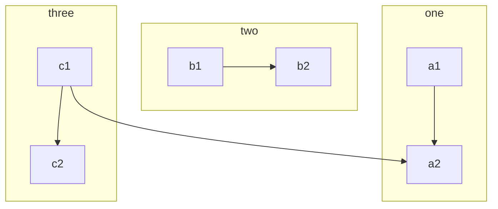
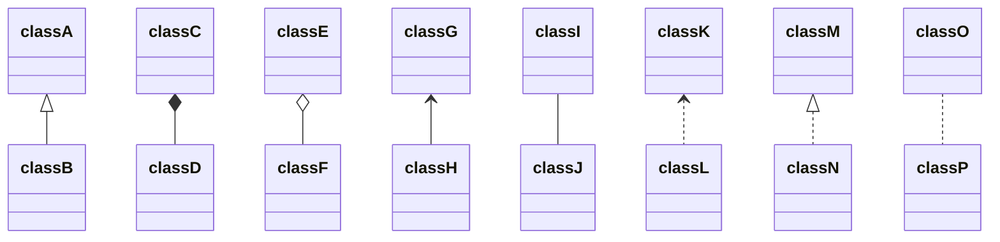
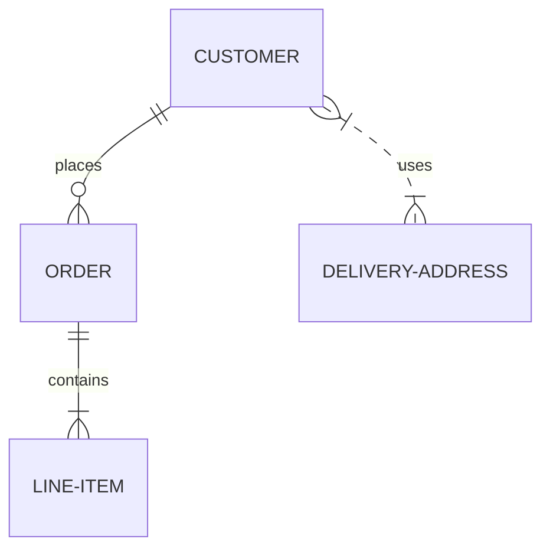

# Markdown Elements

## 텍스트
텍스트는  **\*\*굵은글\*\***, _\_이탤릭\__, or ~~\~\~지움\~\~ ~~.  

문단 구분은 줄 2줄 띄우기

문단 구분은 줄 2줄 띄우기

줄바꿈은 줄 뒤에 **스페이스** 두개 이후 줄바꿈  
해야 줄이 변경되며, 그이외의 WhiteSpace는 줄여서 표현된다. 

구문 이스케이프는 \ 백슬래시 이다. 

## 링크

>\[링크](https://github.com)  

[링크](https://github.com) 는 밑줄 없이 표현된다(마우스 오버되면 나타남).

> 링크뒤에 \{:target="_blank"}를 붙이면 링크가 새창으로 열린다. 

[새창링크](https://github.com){:target="_blank"}

>\!\[이미지](https://github.githubassets.com/images/icons/emoji/octocat.png)
 


작은 이미지는 이미지가 그대로 나오며  
큰 이미지는 사이즈가 줄어들어서 나온다. 

## 설명
> \> 로 줄을 시작하면 텍스트는 회색으로 나오고 현재 이 블록처럼 블록 처리 된다. 

줄바꿈이 2번 될때까지 블록 처리는 사라지지 않는다. 


## 블록

> \`\`\`  
code...  
\`\`\`


```
code...
```

## 카드 (Toast)
> Toast 1
> \`\`\`keyword 
>contents
>\`\`\`

<code>
  note, tip, warning, danger
</code>

note
```note 
content
```

tip
```tip 
content
```

warning
```warning 
content
```

danger
```danger 
content
```

## 카드섹션 (Toast2)
> Toast 2
> \`\`\`keyword 
>contents
>\`\`\`

<code>
  note2, tip2, warning2, danger2, loading
</code>

note2
```note2
content
```

tip2
```tip2
content
```

warning2
```warning2
content
```

danger2
```danger2
content
```

loading
```loading
content
```
## 헤딩
헤딩은 6단계까지 내려간다. 
# Header 1
## Header 2
### Header 3
#### Header 4
##### Header 5
###### Header 6
####### Header 7 ;; 헤딩 처리 되지 않는다. 

## 리스트

```
\- 로 시작히면 정렬되지 않는 리스트
```
- This is an unordered list following a header.
- This is an unordered list following a header.
- This is an unordered list following a header.

```
\1. 과 같이 숫자로 시작하면 정렬된 리스트
```

1. This is an ordered list following a header.
2. This is an ordered list following a header.
3. This is an ordered list following a header.

## 자식 리스트 (Nested List)
```
- Jackson 5
  - Michael ;; 앞에 공백 2개
    - Tito  ;; 앞에 공백 4개
      - Sales
        - Token
          - Coin
- TMNT
  - Leonardo
  - Michelangelo
```

- Jackson 5
  - Michael
    - Tito
      - Sales
        - Token
          - Coin
- TMNT
  - Leonardo
  - Michelangelo


## 표 (Table)

```
| What    | Follows  |
| ------- | -------- |
| A table | A header |
| A table | A header |
| A table | A header |
시작줄은 한줄 띄워져야 한다. 
```

| What    | Follows  |
| ------- | -------- |
| A table | A header |
| A table | A header |
| A table | A header |

표안에 들어가는 내용이 많으면 자동으로 줄바꿈 된다. 

## 가로줄 (Seperator)

> --- (-) 를 3개만 쓰면 가로 줄

---

## 체크박스 리스트 ( Fixed Checkbox )

```
- [x] Create a sample markdown document
- [x] Add task lists to it
- [ ] Take a vacation
```

- [x] Create a sample markdown document
- [x] Add task lists to it
- [ ] Take a vacation

```
- [ ] Steal underpants
- ?
- [ ] Profit!
```

- [ ] Steal underpants
- ?
- [ ] Profit!


## 정의 (Definition)
```
<dl>
    <dt>Name</dt>
    <dd>Godzilla</dd>
    <dt>Born</dt>
    <dd>1952</dd>
    <dt>Birthplace</dt>
    <dd>Japan</dd>
    <dt>Color</dt>
    <dd>Green</dd>
</dl>
```
이것처럼 HTML 구문을 사용할수 있다. 이때 이름은 볼드 이탤릭체로 표시된다. 

<dl>
    <dt>Name</dt>
    <dd>Godzilla</dd>
    <dt>Born</dt>
    <dd>1952</dd>
    <dt>Birthplace</dt>
    <dd>Japan</dd>
    <dt>Color</dt>
    <dd>Green</dd>
</dl>

---

## 주석
```
<!-- prettier-ignore-start -->
```


---

## 코드 스니펫

```
텍스트 중간의 코드 스니펫은  `var foo = "bar";`  ` 로 둘러쌓인 부분이 inline 처리 된다.  

`이렇게 한줄로 여러개가 수직 정렬된다` ~~`이렇게`~~ 
```
텍스트 중간의 코드 스니펫은  `var foo = "bar";`  ` 로 둘러쌓인 부분이 inline 처리 된다.  

`이렇게 한줄로 여러개가 수직 정렬된다` ~~`이렇게`~~ 


Code can also be shown in a block element.

```
var foo = "bar";
```
> ```javascript 이렇게 넣으면 javascript 라고 쓰여지고 syntax highlight 된다. 

```javascript
var foo = "bar";
```
```java
var foo = "bar";
```
```c
char foo =
  "The same thing is true for code with syntax highlighting. A single line of code should horizontally scroll if it is really long.";
```


## Mermaid
    ```mermaid
    graph TB
        c1-->a2
        subgraph one
        a1-->a2
        end
        subgraph two
        b1-->b2
        end
        subgraph three
        c1-->c2
        end
    ```


    ```mermaid
    graph TD;
        A-->B;
        A-->C;
        B-->D;
        C-->D;
    ```


    ```mermaid
    classDiagram
    classA <|-- classB
    classC *-- classD
    classE o-- classF
    classG <-- classH
    classI -- classJ
    classK <.. classL
    classM <|.. classN
    classO .. classP
    ```



    ```mermaid
    erDiagram
        CUSTOMER ||--o{ ORDER : places
        ORDER ||--|{ LINE-ITEM : contains
        CUSTOMER }|..|{ DELIVERY-ADDRESS : uses
    ```



## 이모티콘 (이모지)
   :code: 

* 아래 이모티콘 클릭하고 그냥 붙여넣기 하는게 편함

## 아바타 

```

```



# 멘션


```
Hey @urfish, what do you think of this?
```

Hey @urfish, what do you think of this?

```tip
Set config `plugins: [jekyll-mentions]`

For documentation, see: [https://github.com/jekyll/jekyll-mentions](https://github.com/jekyll/jekyll-mentions)
```

## 폰트

`{:.font-mono}`

```
{{ page.text -}}
```

`{:.font-body}`

{:.font-body}
{{ page.text }}

`{:.font-head}`

{:.font-head}
{{ page.text }}

## font-awesome

```html
<i class="fa fa-check-circle text-green">checked</i>
<i class="fa fa-battery-quarter text-red">battery</i>
```

<i class="fa fa-check-circle text-green">checked</i>
<i class="fa fa-battery-quarter text-red">battery</i>

## 수식

$$
\begin{aligned}
  & \phi(x,y) = \phi \left(\sum_{i=1}^n x_ie_i, \sum_{j=1}^n y_je_j \right)
  = \sum_{i=1}^n \sum_{j=1}^n x_i y_j \phi(e_i, e_j) = \\
  & (x_1, \ldots, x_n) \left( \begin{array}{ccc}
      \phi(e_1, e_1) & \cdots & \phi(e_1, e_n) \\
      \vdots & \ddots & \vdots \\
      \phi(e_n, e_1) & \cdots & \phi(e_n, e_n)
    \end{array} \right)
  \left( \begin{array}{c}
      y_1 \\
      \vdots \\
      y_n
    \end{array} \right)
\end{aligned}
$$

```note
보다 많은 정보, see: [https://kramdown.gettalong.org/syntax.html#math-blocks](https://kramdown.gettalong.org/syntax.html#math-blocks)
```